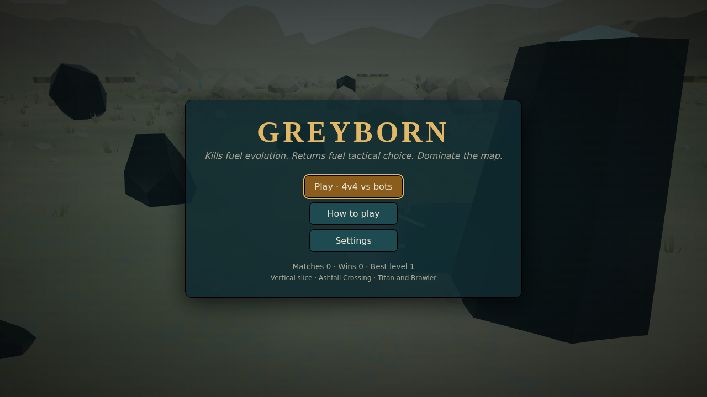
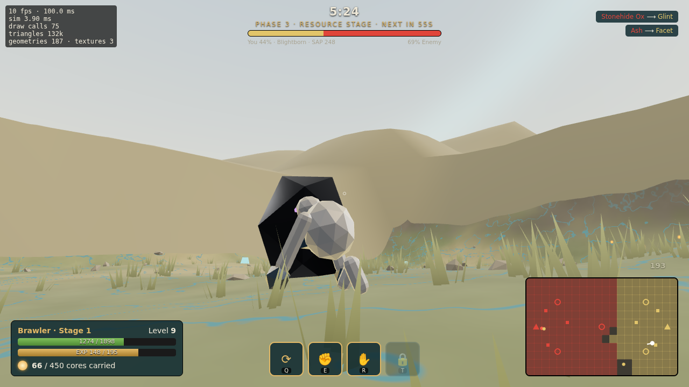
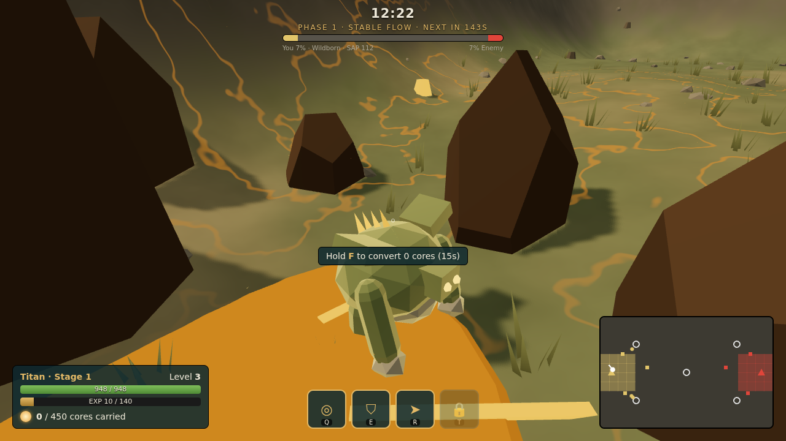
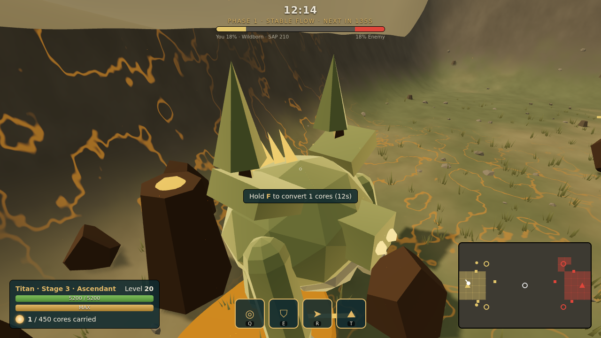

# Greyborn — the game

A 3D team PvP game of monster evolution and territory, built with three.js
and TypeScript. This folder is the playable game; the design lives in
`../gdd/`, the numbers in `../spec/`, and the balance simulator in `../sim/`.

**Current build: Milestone 1 vertical slice.** You play a 4v4 match on
Ashfall Crossing (you plus 3 bot allies against 4 bots) as a Titan or a
Brawler. You start as a small Kith and grow through three Stages into a
7.5 m Ascendant while rooting territory, taking Hubs and sieging the
enemy's Enemy Cores and Base Heart.

## Screenshots

Captured by the automated tests under software rendering (no GPU), so
they show the Low/Medium presets.

| | |
|---|---|
|  |  |
|  |  |

## Play it

Needs Node.js 20+ and a browser with WebGL 2.

```bash
cd game
npm install
npm run dev          # http://localhost:5173
```

Production build:

```bash
npm run build        # outputs dist/ (static files; host anywhere)
npm run preview      # serves dist/ at http://localhost:4173
```

Controls are listed in-game under **How to play** and in `GAME_DESIGN.md`.

## Develop

| Command | What it does |
|---|---|
| `npm run dev` | Dev server with hot reload |
| `npm run typecheck` | TypeScript, strict |
| `npm test` | Unit and headless-match tests (Vitest) |
| `npm run build` | Typecheck + production bundle |
| `npm run data` | Re-export `../spec/greyborn-tuning.xlsx` to `src/data/tuning.json` |
| `node tests/e2e/smoke.mjs <url>` | Automated browser playtest (needs Playwright + Chromium) |
| `node tests/e2e/showcase.mjs <url>` | Screenshots of each lineage at each Stage |

## Documents

| File | Contents |
|---|---|
| `GAME_DESIGN.md` | The design of this playable build, scope and decisions |
| `ARCHITECTURE.md` | Engine decision, layers, systems |
| `ROADMAP.md` | Milestones and status |
| `TASKS.md` | Completed, in progress, next, bugs, technical debt |
| `TESTING.md` | What is tested and how, with the latest results |
| `PERFORMANCE.md` | Measurements and budgets |
| `KNOWN_ISSUES.md` | What's broken or unverified |
| `ASSETS.md` | Every asset and its source/licence |
| `TOOLS.md` | The development environment, as verified |
| `CHANGELOG.md` | Changes by version |
| `RELEASE_CHECKLIST.md` | What must be true before a release |
